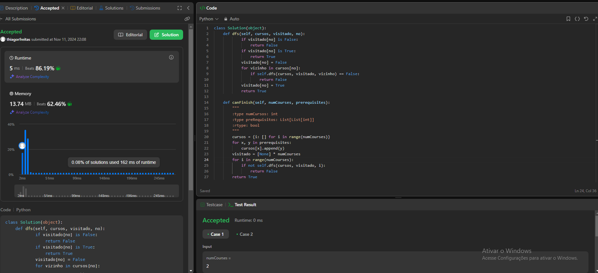

# Grafos 1 - LeetCode - Dupla 56

**Número da Lista**: 1 
**Conteúdo da Disciplina**: Grafos 1 

## Alunos
|Matrícula | Aluno |
| -- | -- |
| 20/0015753  |  [Caio Berg Carlos Leite](https://github.com/Caio-bergbjj) |
| 20/0028154 |  [Thiago Ribeiro Freitas](https://github.com/thiagorfreitas) |

## Sobre 
Este projeto consiste na resolução de um problema específico de grafos do LeetCode, para a disciplina de Projeto de Algoritmos, da Universidade de Brasília.

### Problemas

|Problema | Descrição | Dificuldade| Contribuidores
| -- | -- | -- | -- |
| 2608  |  [Shortest Cycle in a Graph](https://leetcode.com/problems/shortest-cycle-in-a-graph/) | Difícil | [Caio Berg](https://github.com/Caio-bergbjj) |
| 207  |  [Course Schedule](https://leetcode.com/problems/course-schedule/) | Médio | [Thiago Freitas](https://github.com/thiagorfreitas) |
| 1971 | [Find if Path Exists in Graph](https://leetcode.com/problems/find-if-path-exists-in-graph/) | Fácil | [Caio Berg](https://github.com/Caio-bergbjj) |
| 997  |  [Find the Town Judge](https://leetcode.com/problems/find-the-town-judge/) | Fácil | [Thiago Freitas](https://github.com/thiagorfreitas) |

## Screenshots

### Course Schedule

### Shortest Cycle in a Graph

### Find if Path Exists in Graph

### Find the Town Judge

